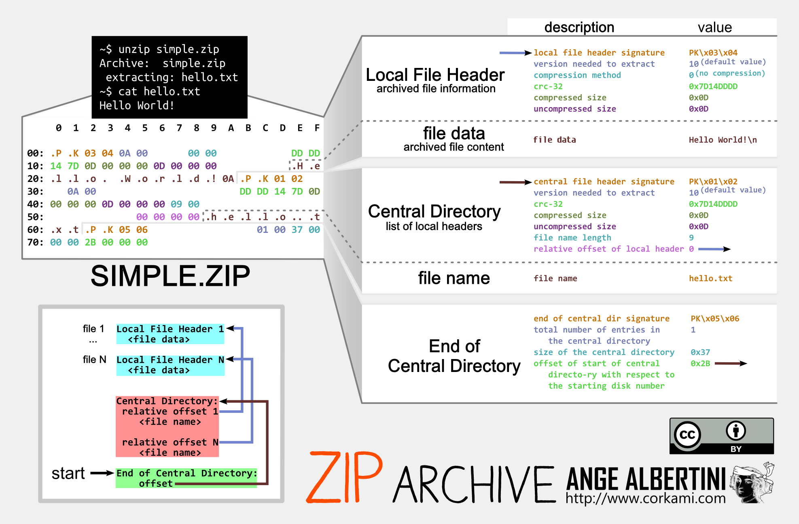

# Artifact Bunker


## Description

> Pst... How safe do you feel your CI pipeline is? Because I'll tell you, disaster could strike at any moment.
>
> Grab hold of all your archives and I'll show you a place where they will protected through the incoming cataclysm...
>
> Descend into our [artifact bunker](http://artifact-bunker-6qh4dbttgztzy.shellweplayaga.me/)
>
> NOTE: Your team can only have one connection to the server at a time and it is ratelimited. You can run the server locally instead but **keep the connection limit in mind**. The flag will have the `flag{`...`}` format

[](./handout)

## Solution

### Service Description

The handout can be used to run a copy of the service, which is a basic file store for zips and tars:

<div align="center">


</div>

The web interface is just a stylized wrapper around some commands sent over a websocket, so a teammate wrote a python client for us to use instead.

The commands are:

- `upload`: upload a zip or tar
- `download`: download an entry from a zip
- `list`: list files in a directory
- `clean-all`: delete all zip archives
- `job`: run a CI job

The backend filesystem can be thought of as two parts:

- `/data` where user uploads and build results are stored. This is where zip entries can be read by users
- `/project` where the CI job configuration is defined and where the flag file resides

When users upload a tar or zip archive, the server unpackages the entries of the archive and rezips them, ensuring that no secrets or flags make it into the processed archive (defined at [`/opt/project.cfg`](./handout/dist/project.cfg)).

Entries that match "ignored" filenames have their contents replaced entirely with `***` and entries with contents that contain "secrets" just have the secret part censored.

This same process applies to the build job. When the job is run, artifacts specified in the build script are put into a tar file, then unpackaged and put into a zip with each file having gone through the filters in the function `compressed_files()`:

<div align="center">


</div>

A core component of the problem is that the only way to retrieve a file is by requesting a valid entry from a zip archive that lives on the server.

### YAML Injection

The `job` command allows users to run a single job defined at [`/project/build.job`](./handout/dist/project/build.job):

```yaml
job:
  steps:
    - use: archive
      name: "{{.Name}}-{{.Commit}}-{{.Timestamp}}"
      artifacts:
        - "bunker-expansion-plan.txt"
        - "new-layer-blueprint.txt"
```

It's a [template](https://pkg.go.dev/text/template) file that takes user input to populate the `{{.Name}}` field. By default, the `flag.txt` is not archived in the job. By adding newlines and spaces to the name argument it's possible to add any file in the `/project` directory file to the archive by replacing the `artifacts` list (and then correctly closing off the injection so the YAML stays valid):

```python
client.run_job('package', urllib.parse.quote('''flag"
      artifacts:
        - "flag.txt"
    - name: "ignore'''))
```

This first creates a file called `/data/flag.tar` that _does_ contain the flag data, and then `/data/flag` which is a zip file that can be read by the user, but contains `***` instead of any flag data.

<div align="center">


</div>

### Partial File Overwrite

So we can get the flag into `/data/flag.tar`, but we can't read it! We can only read zips and the only way to make a zip is through the filter process.

Looking back through the code, we noticed that in `compress_files()`, the function that converts zip/tar -> filtered zip, the resulting zip file is created with:

```go
out_file, err := os.OpenFile(out_path, os.O_WRONLY|os.O_CREATE, 0644)
```

whereas `archive_files()`, the function that creates the unfiltered tar as a part of the build job, creates its file with:

```go
t_file, err := os.OpenFile(t_path, os.O_WRONLY|os.O_CREATE|os.O_TRUNC, 0644)
```

[`os.O_TRUNC`](https://pkg.go.dev/os#OpenFile) is not passed as a flag when creating the filtered zip! This means that writing to an existing file will write directly over the existing data, leaving old data at the end of the file if the new data does not exceed the size of the original file.

...but what can you actually do with it? Well, `compress_files()` will always strip out flag data from the source zip/tar, but the file at `/data/flag.tar` _does_ have the flag data. We just can't read it because it's a tar file. If there were some way to turn `flag.tar` into a valid zip file then we might be able to leak the flag!

Fortunately for us, the way uploads work is that the original tar/zip is written to `/data/` as-is, and then the extension is stripped in `compress_files()` before writing the filtered zip version.

So if we upload `flag.tar.tar` or `flag.tar.zip`, the resulting `flag.tar` will partially overwrite the existing `/data/flag.tar` file if `flag.tar.zip` is small enough! In fact, all of the original zip data in our upload will still be retrievable!

<div align="center">


</div>

### How .zip Works

Okay, we can now create a valid zip archive at `/data/flag.tar` that has flag data trailing at the end, but we can only retrieve the zip contents that we upload because that part is a valid zip, the trailing data at the end is not a zip entry. Is there any way we can manipulate the zip file format to get the flag data?

We're going to have to learn how zip files work. Wikipedia is of course a great resource (https://en.wikipedia.org/wiki/ZIP_(file_format)), but Ange Albertini's (@corkami) work is my first stop for getting an idea of how a file format works. He has a treasure trove of diagrams that cover a ton of different formats. Here's one of his images for zip archives (Source: https://github.com/corkami/pics/blob/master/binary/ZIP.png):

<div align="center">



</div>

This diagram can't be relied on as a current ZIP spec (as we learned, that cost us some time), but it gets the point across. Current zip archives have a lot more metadata in the local file header, central directories, and end of central directory blocks.

What's important is that the **_END_** of the file is where zip parsers are supposed to start scanning for the End of Central Directory (EOCD). This block points to the offset in the file where the Central Directory starts. From there the parser can hop to the Central Directory to get stuff like the filenames of the entries and where to find entry content.

We don't control the zip file that gets parsed by the server (we control the uploaded zip, but that gets parsed and reassembled), so we can't actually control any of this metadata directly... what we can do though is upload a zip to partially overwrite the flag, then **write another zip over the first one to gain control of the Central Directory**!

### Leaking The Flag

The final exploit looks like this:

<div align="center">


</div>

1. Write a bunch of copies of the flag to make a large `flag.tar` file with plenty of space for our zip shenanigans (easily accomplished by inserting more `flag.txt` lines into the build job with our YAML injection)
2. Create and upload a zip file that has enough data in it to fit a second zip and a second zip's Central Directory, and with a filename that is large enough to contain an End of Central Directory block
3. Create a and upload a second zip file that has _just enough_ data so that the filename aligns with the central directory of the previous zip, and then use the filename to write our very own Central Directory! The trick here is to set the compression type to none and the file size to be large enough to also grab at least one copy of the flag

The full solution scripts are in [./solution/solve.py](./solution/solve.py) and [./solution/zip.go](./solution/zip.go), but here are some of the finer points we had to work through:

- Compression changes the size of your data and the data in the zips needs to be larger than a Central Directory entry. To account for this, we used "random" data with a fixed seed to keep things consistent
- Null bytes were one of our biggest hurdles. The filename of the second zip needs nulls to set Central Directory values properly (like compression type and local header offset). Python would happily create tars that had files with null bytes, but the Go library didn't like it. Python wouldn't make zip entries with null bytes in the filenames, but our [`zip.go`](./solution/zip.go) solution did
- To get the offset just right, we basically eyeballed it with `xxd` and adjusted filenames/data size until it was correct. We probably should've been more scientific about it but I was tired
- I thought we might need to also create a new Local File Header to point directly to the flag data because file size is also specified in that header, but on accident we set the file size in our Central Directory big enough to cover the entire file and we got the flag back!

For the first zip we actually used a tar. But this gets converted into a zip by the server so the same principle applies and we still called it zip1:

```python
zip1_fo = io.BytesIO(random.randbytes(17592)) # manually binsearched this value until it looked right in xxd *shrug*
zip1_ti = tarfile.TarInfo(name='z' * 1585) # use large filename to hold EOCD of second zip
zip1_ti.size = len(zip1_fo.getvalue())
# use flag.tar.tar so that it partially overwrites flag content tarfile as a zip at flag.tar
with tarfile.open('flag.tar.tar', 'w') as tar:
    tar.addfile(zip1_ti, zip1_fo)
```

Note that this file is waaaaay larger than it needs to be, but we started out with some big numbers when testing and it just stuck.

The second zip was made with Go because of the null byte problems:

```go
// Create
zipEntry, err := zipWriter.Create("PK\x01\x02" + // header
  "\x01\x01" + // creation version
  "\x01\x01" + // extract version
  "\x01\x01" + // bitflag
  "\x00\x00" + // compression method (none)
  "\x01\x01\x01\x01" + // last modified date
  "\x02\x02\x02\x02" + // crc
  "\x01\x01\x01\x01" + // size compressed (needs to be large enough to get zip data)
  "\x01\x01\x01\x01" + // uncompressed size (same as compressed for none type)
  "\x01\x01" + // filename length
  "\x01\x01" + // extra field
  "\x01\x01" + // file comment
  "\x01\x01" + // number of disk
  "\x01\x01" + // internal file attr
  "\x01\x01\x01\x01" + // external file attr
  "\x00\x00\x00\x00" + // offset of loc (point to beginning of file w/ valid loc header)
  strings.Repeat("a", 513) + // filename
  strings.Repeat("b", 513) + // extra field
  strings.Repeat("c", 513)) // comment

data := make([]byte, 17546)
rand.Read(data)
zipEntry.Write(data)
```

The filename of the entry in the second zip becomes the new Central Directory that the first zip's End of Central Directory points to. There are a lot of`\x01`'s because we had almost given up on creating a working zip/tar that had null bytes in the filename.

This is enough to leak the flag! The End of Central Directory will point to the filename of the second zip and the second zip will point to the beginning of the file, but sets compression type to "none" and sets the compressed/uncompressed size to `\x01\x01\x01\x01` which is 16843009, plenty to pull the whole file down.

And finally, running the `solve.py` script after running `go run zip.go` gives the flag!

```
job complete
upload-success flag.tar Remote directory `flag.tar` created
upload-success flag.tar Remote directory `flag.tar` created
flag: b'flug{FLAG WILL BE IN THIS FILE AND WILL LIKELY BE FAIRLY LENGTHY BUT YOU PROBABLY ALREADY KNEW THAT SO JUST WRITE A GOOD EXPLOIT OK}'
```

This was a really fun challenge that did a good job of combining several concepts in a way that felt "realistic" but also very enjoyable to solve. Turns out the challenge author took inspiration from the [Acropalypse](https://en.wikipedia.org/wiki/ACropalypse) vuln where edited screenshots were only partially overwritten with the edited file and the flavor text was hinting at it (I certainly didn't catch it):


